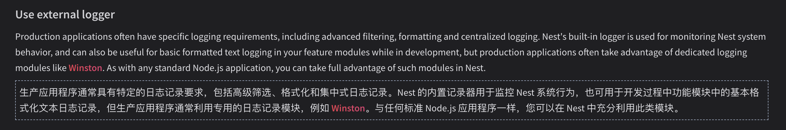
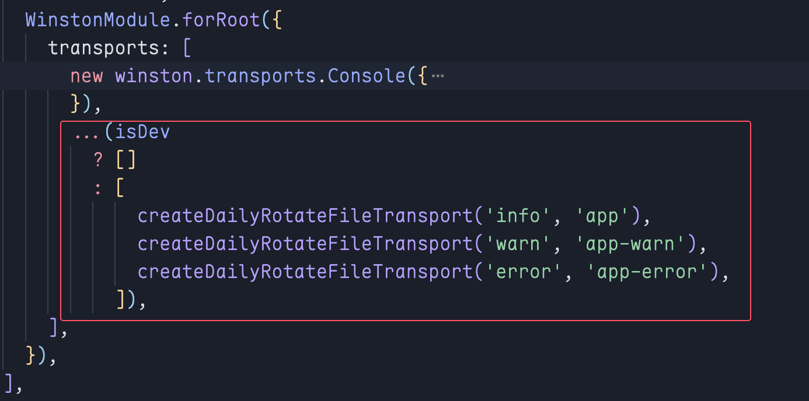

# 日志模块

[参考文档](https://docs.nestjs.com/techniques/logger#extend-built-in-logger)
[nest-winston](https://www.npmjs.com/package/nest-winston)

Nest有自带的日志模块,但是不方便我们后续生产部署查看

自带日志模块的使用: `Logger`


```typescript
import { Logger } from '@nestjs/common';

const logger = new Logger('App'); // 传递模块名

logger.log('info');
logger.error('error');
logger.warn('warn');
logger.debug('debug');
logger.verbose('verbose');
```


如果需要关闭自带的日志模块，在 `main.ts` 中添加代码：

```typescript
const app = await NestFactory.create(AppModule, {
  logger: false,
});
await app.listen(process.env.PORT ?? 3000);
```

因此我们采用 `winston` 来实现文件日志, `nest-winston` 可以替换掉nest自带的日志模块。




1. 安装别人集成的 `nest-winston`


```bash
pnpm add nest-winston winston
```

2. 在 `app.module.ts` 中引入模块和 `winston`


```typescript
import { WinstonModule } from 'nest-winston';
import * as winston from 'winston';

@Module({
  imports: [WinstonModule.forRoot({})],
})
export class AppModule {}
```


3. 默认的格式化很丑,我们需要自己配置 `transports`

```typescript
WinstonModule.forRoot({
    transports: [
    new winston.transports.Console({
        level: 'silly',
        format: winston.format.combine( // 组合格式
        winston.format.timestamp(), // 时间戳
        winston.format.ms(), // 毫秒
        nestWinstonUtils.format.nestLike('MyApp', { // 美化
            colors: true, // 颜色
            prettyPrint: true, // 美化
            processId: true, // 进程id
            appName: true, // 应用名
        }),
        ),
    }),
    ],
}),
```

4. 使用

```typescript
import {
  Controller,
  Get,
  Inject,
  LoggerService,
  OnModuleInit,
} from '@nestjs/common';
import { AppService } from './app.service';
import { WINSTON_MODULE_NEST_PROVIDER } from 'nest-winston';

@Controller()
export class AppController implements OnModuleInit {
  @Inject(WINSTON_MODULE_NEST_PROVIDER)
  private readonly logger: LoggerService;

  constructor(private readonly appService: AppService) {}

  onModuleInit() {
    this.logger.log('AppController constructor');
    this.logger.error('AppController constructor');
    this.logger.warn('AppController constructor');
    this.logger.debug('AppController constructor');
    this.logger.verbose('AppController constructor');
  }

  @Get()
  async getHello() {
    console.log(await this.appService.getHello());
  }
}
```


5. 日志等级

```json
{
  error: 0,
  warn: 1,
  info: 2,
  http: 3,
  verbose: 4,
  debug: 5,
  silly: 6
}
```

将等级设置为 `silly` 可以打印出所有的日志

6. 设置日志文件，并按天分割日志


按天分割需要借助 `winston-daily-rotate-file` 模块

```bash
pnpm add winston-daily-rotate-file
pnpm add cross-env -D # 需要借助cross-env来区分开发环境和生产环境,然后是否写入文件
```


```typescript
import * as DailyRotateFile from 'winston-daily-rotate-file';

const isDev = process.env.NODE_ENV == 'development';

function createDailyRotateFileTransport(level: string, fileName: string) {
  return new DailyRotateFile({
    level,
    dirname: 'logs',
    filename: `${fileName}-%DATE%.log`,
    datePattern: 'YYYY-MM-DD-HH', // 日期格式
    zippedArchive: true, // 归档压缩
    maxFiles: '14d', // 最大保存14天
    maxSize: '20m', // 最大大小
    format: winston.format.combine(
      winston.format.timestamp(),
      winston.format.simple(), // 简单格式
    ),
  });
}
```


